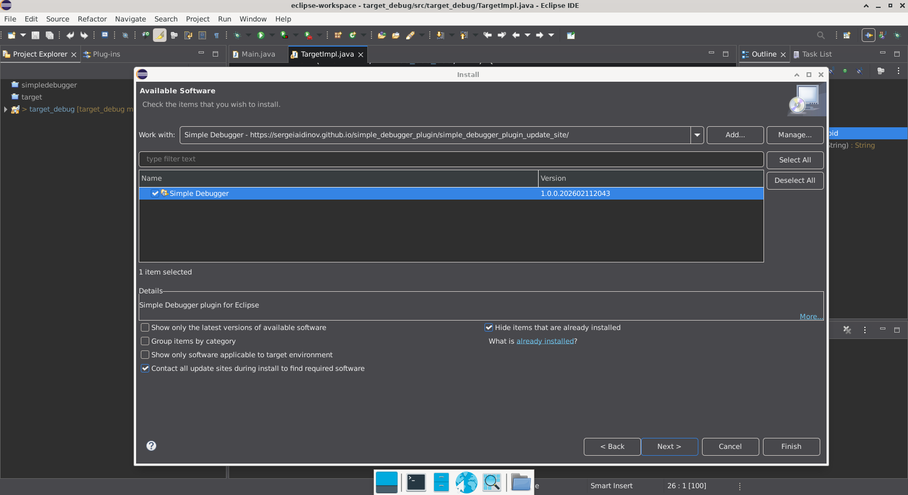
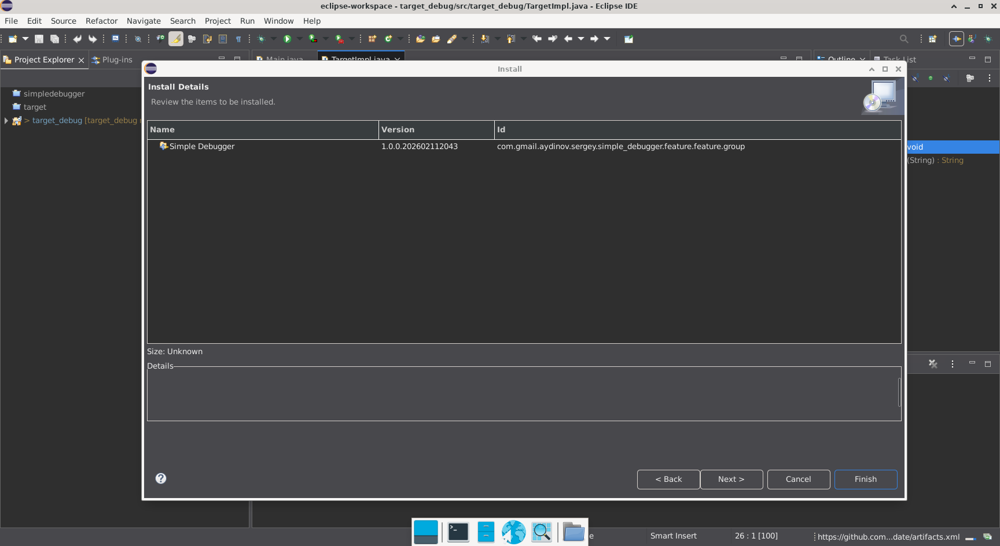
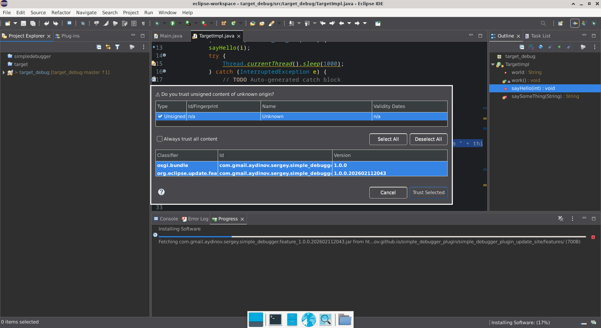
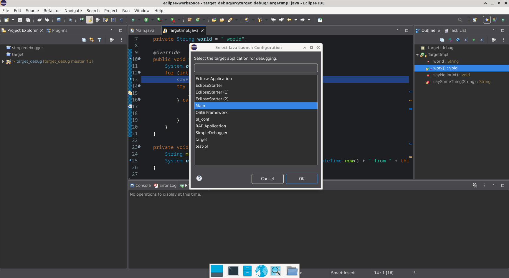
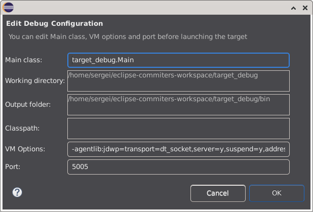
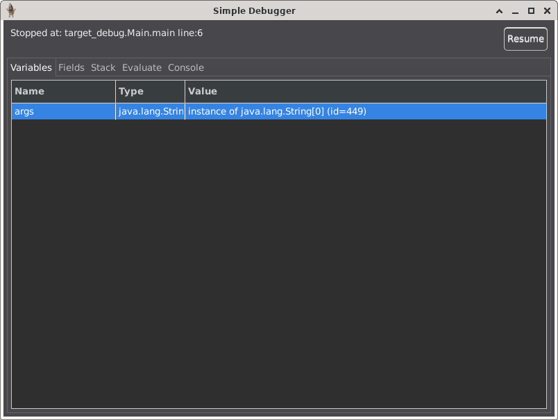
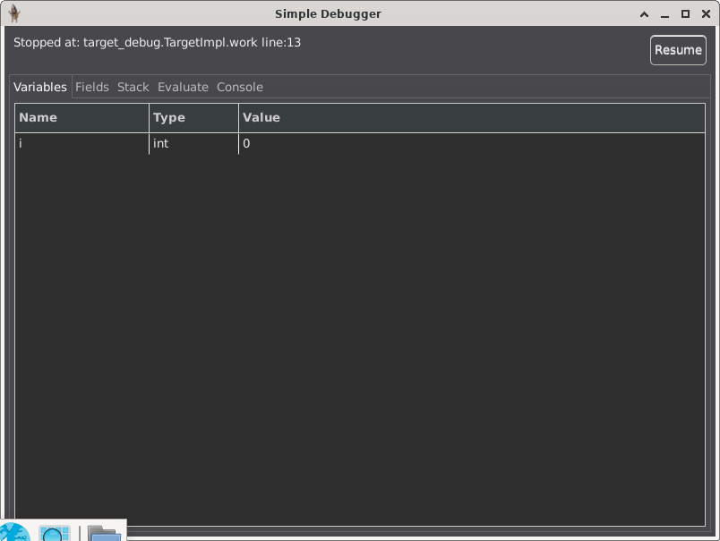
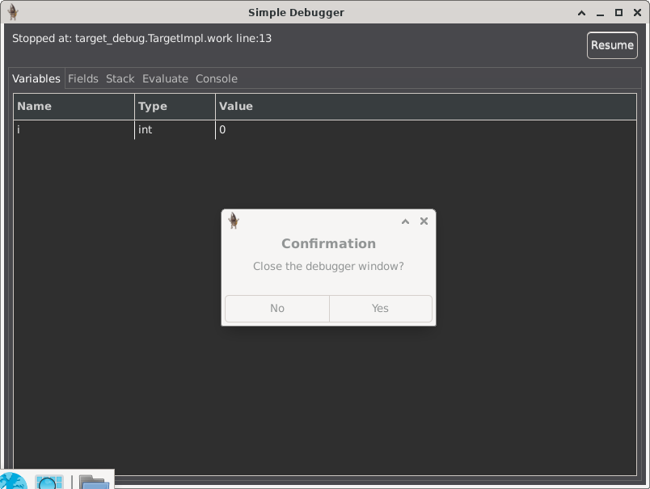

# Simple Debugger

## Project Description

**Simple Debugger** is a lightweight plugin for the Eclipse IDE.

This is the first working version of the plugin and currently provides a limited but functional feature set.

In addition to the plugin itself, the repository includes a demonstration application called `target_debug`, which can be used to showcase the plugin’s functionality.

When launched, the plugin automatically sets a breakpoint at the first line of executable code. It allows the user to:

- define basic startup parameters,
- modify local variable values during debugging,
- change the value of a field within the context of the currently executing method (without altering the actual field value in the class),
- view the current call stack,
- inspect the console output.

Further development of the plugin is planned, and additional functionality will be introduced in future versions.

## Table of Contents

- [Project Description](#project-description)
- [Installation](#installation)
- [Usage](#usage)
- [Documentation](https://sergeiaidinov.github.io/simple_debugger_plugin/docs/)
- [License](#license)

## Installation

The plugin can be installed directly from the GitHub Pages update site.

1. Open Eclipse and go to **Help → Install New Software…**  
   Click **Add…**, enter a name for the update site (for example, *Simple Debugger*), and specify the following URL:
https://sergeiaidinov.github.io/simple_debugger_plugin/simple_debugger_plugin_update_site/

<!-- Screenshot: update site name and URL -->

2. After confirming the update site, select **Simple Debugger** from the list and click **Finish**:

<!-- Screenshot: Finish button -->

3. When prompted by Eclipse, confirm the installation by clicking **Trust Selected**:

<!-- Screenshot: Trust Selected dialog -->

4. Restart Eclipse if prompted to complete the installation.

## Usage

After installation, the plugin can be launched from:

**Run → Simple Debugger**

The plugin provides basic debugging functionality. Follow these steps:

1. **Select the debug configuration**  
   Choose which target application to debug.

   

2. **Edit configuration parameters**  
   Modify startup parameters, if necessary.

   

3. **Breakpoint at the first line**  
   When launched, the plugin automatically sets a breakpoint at the first line of executable code.

   

4. **Breakpoint at a previously set point**  
   The plugin stops at user-defined breakpoints as well.

   

5. **Confirm closing the debugger window**  
   When stopping the debugger, confirm any prompts to close the window.

   

6. **Debugger disabled notification**  
   After stopping, the plugin notifies that the debugger is disabled and the Java virtual machine continues running.

   

## License

This project is licensed under the [MIT License](LICENSE).

